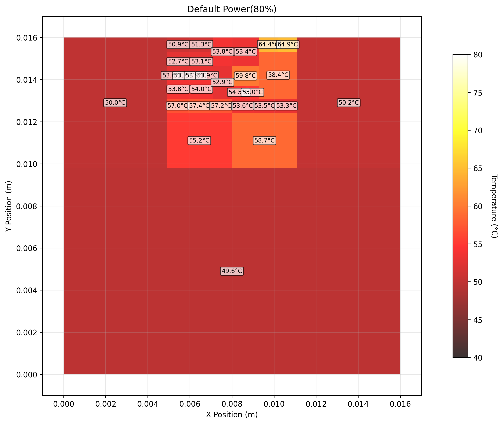
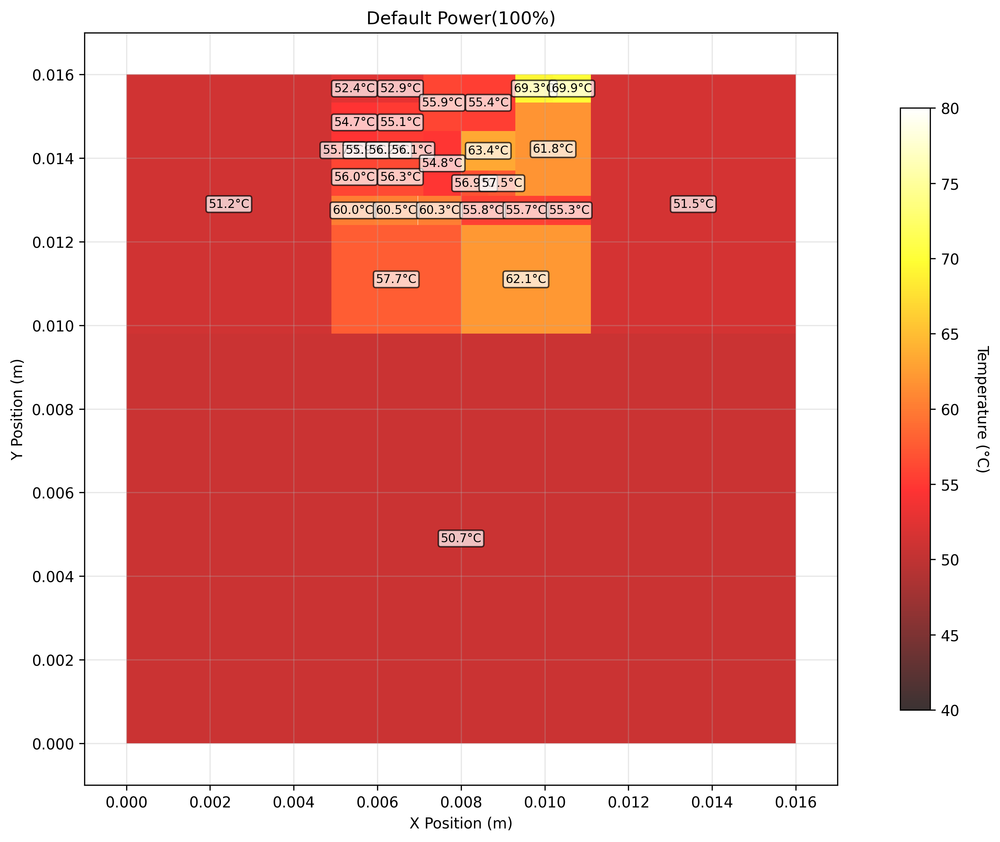
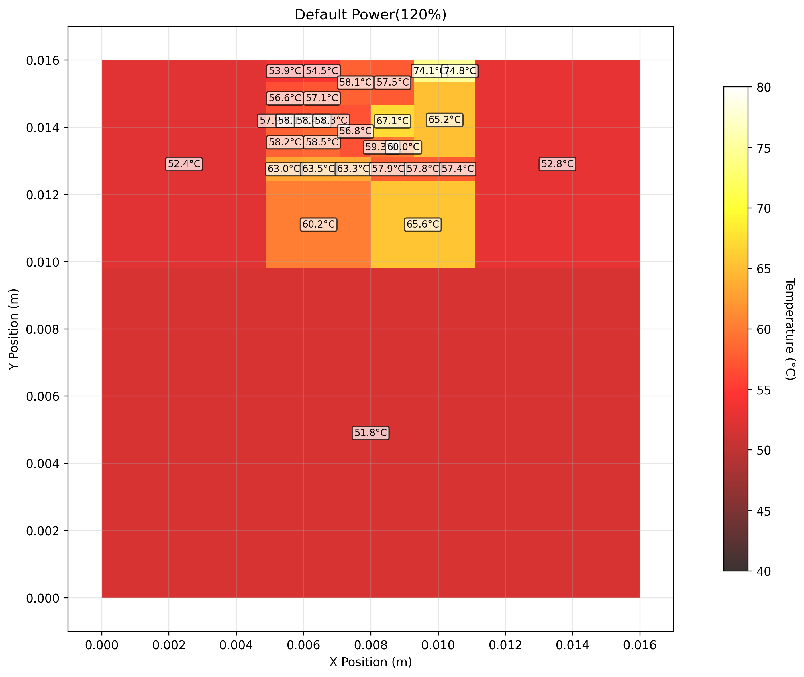
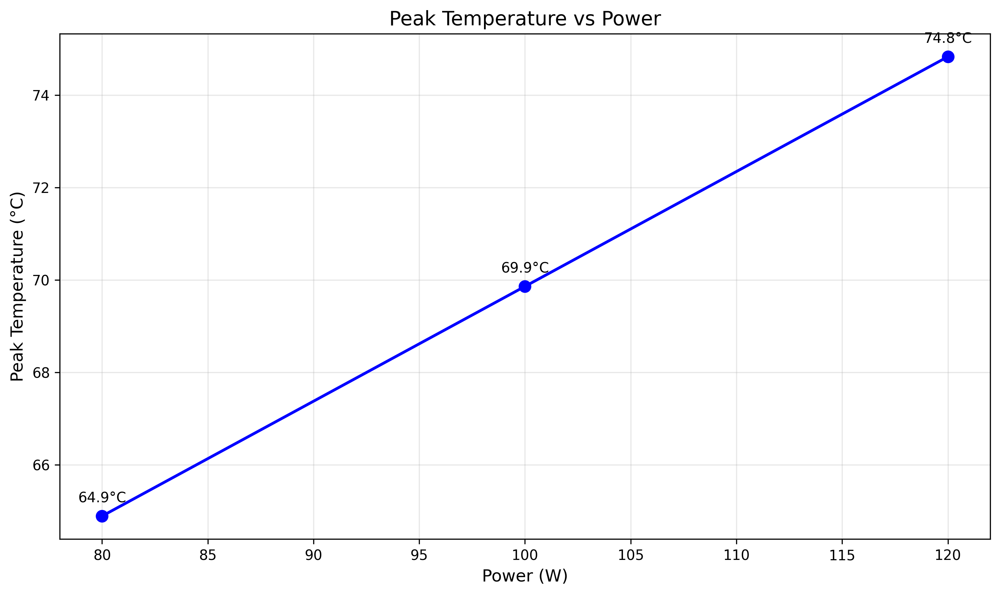
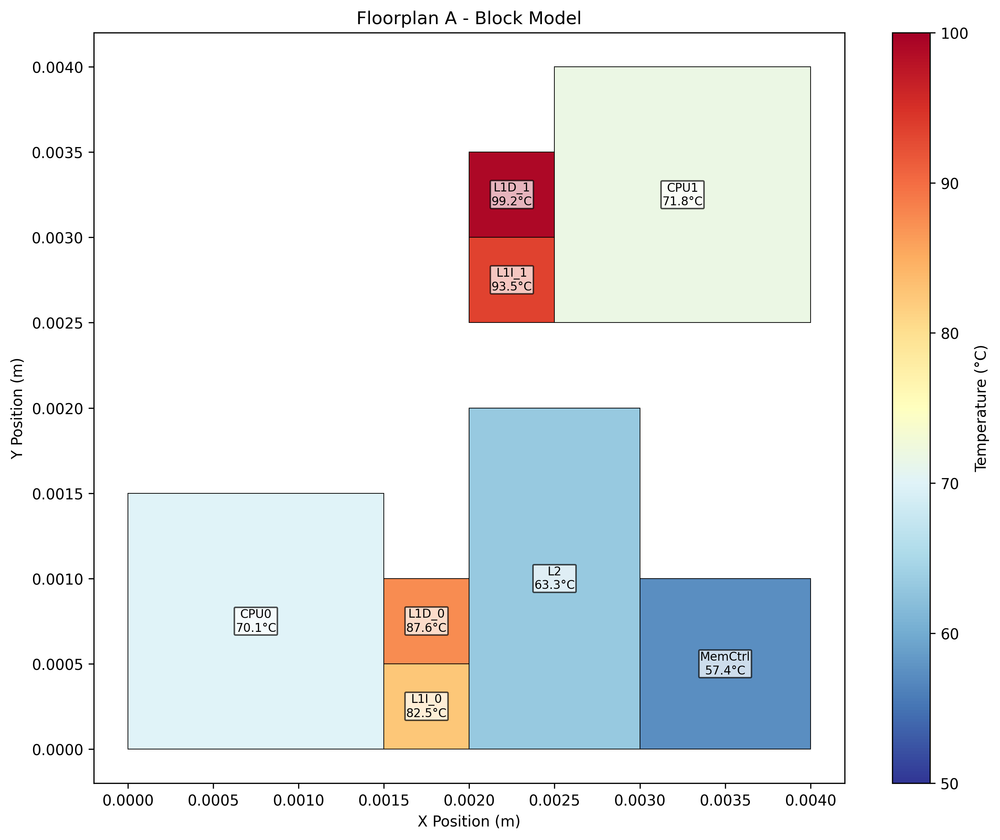
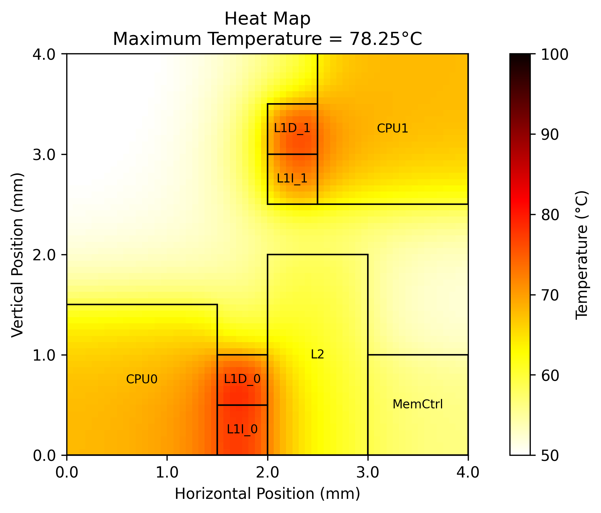
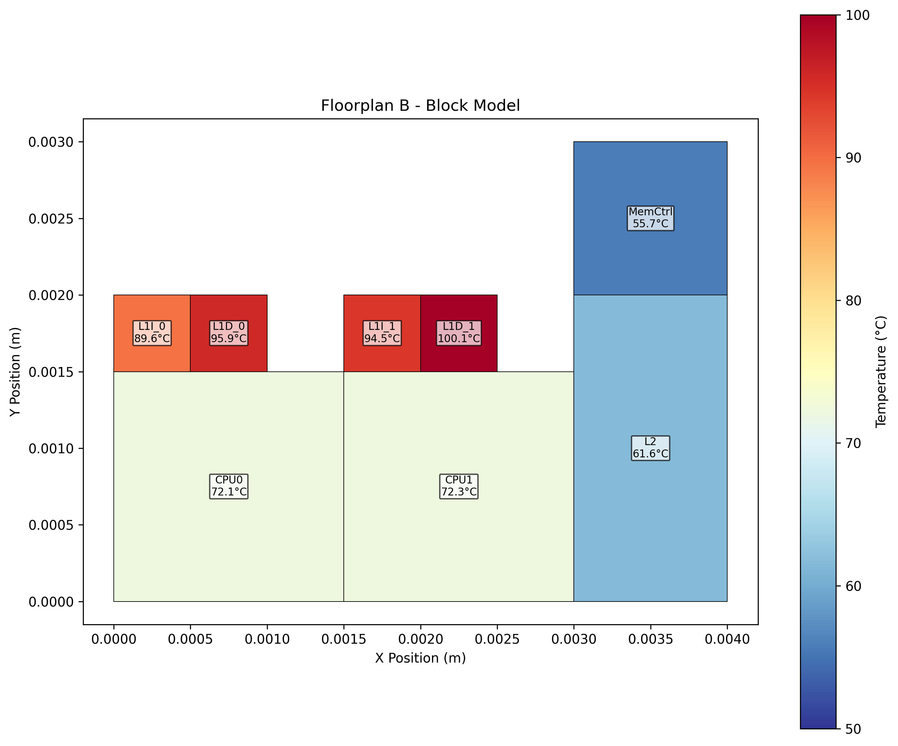
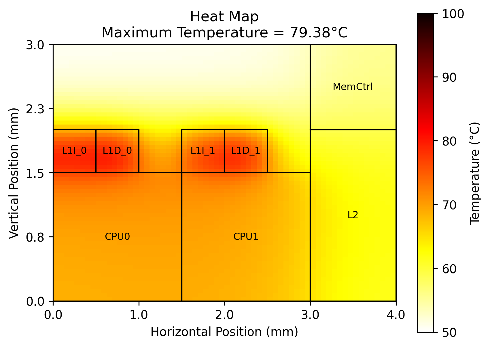
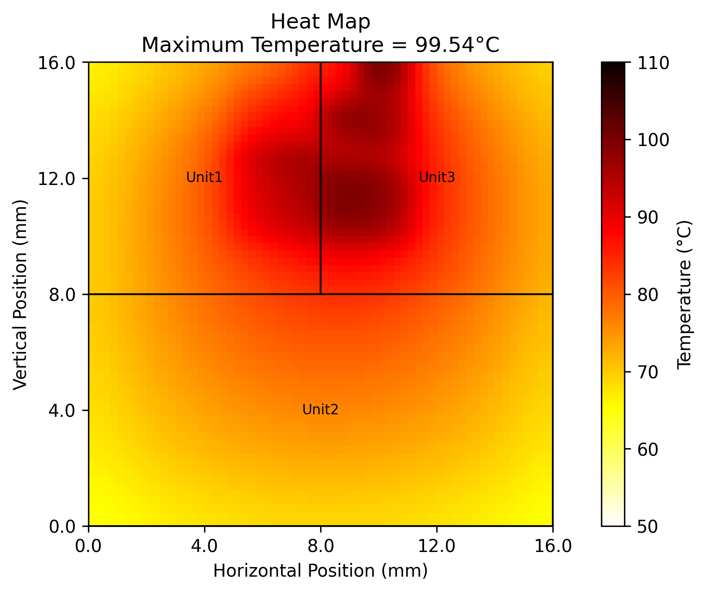
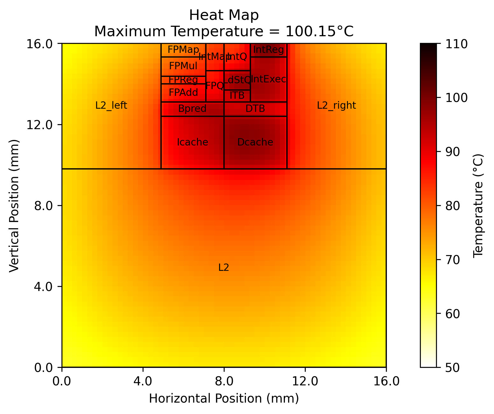

# Lab2 Hotspot Report

Ruyi SONG  21213088

## Task 1. Basic Thermal Simulation

### Baseline Run and Multiple Power Levels

For this task, I ran thermal simulations at three different power levels (80W, 100W, and 120W) using the HotSpot simulator with a floorplan resembling the Alpha EV6 processor. The simulations used the Block model with default parameters.

### Heatmaps

The heatmaps below show the temperature distribution for each power level:

### Temperature vs Power Curve

The graph below shows the linear relationship between power consumption and peak temperature:

### Peak Temperature Results

| Power (W) | Peak Temperature (K) | Peak Temperature (°C) | Peak Unit |
|-----------|----------------------|-----------------------|-----------|
| 80        | 338.04               | 64.89                 | IntReg_1  |
| 100       | 343.01               | 69.86                 | IntReg_1  |
| 120       | 347.98               | 74.83                 | IntReg_1  |

The data shows a clear linear relationship with a thermal resistance of approximately 0.25 K/W. The IntReg_1 unit consistently exhibits the highest temperatures across all power levels, making it a thermal bottleneck in the design.

## Task 2. Chip Floorplan Optimization

### Two Floorplans: Dispersed vs Concentrated

For this task, I analyzed two different floorplan layouts using both Block and Grid thermal modeling approaches:

- **Layout A (Dispersed)**: High-power components are positioned diagonally across the chip to distribute heat
- **Layout B (Concentrated)**: High-power components are positioned adjacent to each other in the bottom-left corner

### Heatmaps

The heatmaps below show the temperature distributions for each layout and model combination:

### Peak Temperature Comparison Table

| Component    | Layout A Block (°C) | Layout B Block (°C) | Layout A Grid (°C) | Layout B Grid (°C) |
|--------------|---------------------|---------------------|--------------------|--------------------|
| CPU0         | 70.1                | 72.1                | 67.3               | 70.1               |
| CPU1         | 71.8                | 72.3                | 66.9               | 68.7               |
| L1D_0        | 87.6                | 95.9                | 74.9               | 75.2               |
| L1D_1        | 99.2                | 100.1               | 72.3               | 73.7               |
| L1I_0        | 82.5                | 89.6                | 76.3               | 76.3               |
| L1I_1        | 93.5                | 94.5                | 69.5               | 73.3               |
| L2           | 63.3                | 61.6                | 61.3               | 62.2               |
| MemCtrl      | 57.4                | 55.7                | 56.6               | 56.2               |

### Brief Comparison

The analysis reveals that floorplan arrangement significantly impacts thermal performance:

1. **Layout A (Dispersed)** outperforms Layout B (Concentrated) in terms of thermal management:
   - Lower peak temperatures across critical components
   - Largest improvement seen in L1D_0 (8.3°C cooler in Block model)
   - Reduced thermal coupling between adjacent high-power units

2. **Grid vs Block Model Differences**:
   - Grid model predicts consistently lower temperatures than Block model (average difference ~4°C)
   - Grid model provides more detailed spatial resolution, revealing intra-unit temperature variations
   - Block model offers faster simulation times but provides conservative (higher) temperature estimates

Layout A is recommended as it achieves better thermal performance by distributing heat sources and reducing hot spots.

## Task 3. 3D stacking

### 3D Stacking Analysis

For this bonus task, I analyzed the thermal characteristics of 3D stacked integrated circuits compared to traditional 2D designs.

### Heatmaps

The heatmaps below show the temperature distributions for the 3D stack:

### Temperature Comparison

| Configuration | Peak Temperature (K) | Peak Temperature (°C) | Peak Unit/Location |
|---------------|----------------------|-----------------------|---------------------|
| 2D Design     | 337.98               | 64.8                  | IntReg_0            |
| 3D Design     | 369.42               | 96.3                  | layer_2_IntReg      |

### Quantitative Takeaway

The 3D stacking configuration shows a significant increase in peak temperature:
- **Temperature Increase**: 31.4°C (48.4% increase)
- **Primary Cause**: Thermal resistance of multiple TIM layers between active silicon layers
- **Hot Spot Location**: layer_2_IntReg becomes the critical thermal bottleneck

### Physical Explanation

The increased temperatures in 3D stacking are primarily due to:
1. **Vertical Thermal Resistance**: Multiple TIM layers create cumulative thermal resistance
2. **Heat Accumulation**: Stacked active layers lead to heat buildup between layers
3. **Constrained Heat Flow**: Long thermal pathways with multiple bottlenecks

The 3D configuration requires advanced thermal management strategies such as improved TIM materials or active cooling solutions to mitigate these thermal challenges.

## FAQ Answers

### Q: What are the units of floorplan coordinates?
The units of floorplan coordinates in HotSpot are meters. This includes width, height, left-x coordinate, and bottom-y coordinate. All dimensions in floorplan files (.flp) are specified in meters.

### Q: How many grid cells are needed in the Grid model?
The number of grid cells in the Grid model is configurable:
- Controlled by -grid_rows and -grid_cols parameters
- Default is typically 39×39 = 1,521 grid cells
- Examples often use 64×64 = 4,096 grid cells per layer
- Total grid cells = grid_rows × grid_cols
- For 3D chips, each layer has the same number of grid cells

### Q: What is the steady file format?
The steady file format consists of:
- Each line contains a unit name and its steady-state temperature
- Unit name and temperature are separated by a tab character
- Temperature values are in Kelvin
- Contains temperatures for chip functional units, interface layer, heat spreader, heat sink, and internal nodes

### Q: When to choose Block vs Grid?
Choose Block Model when:
- Computational efficiency is priority (faster calculations)
- Only center temperatures of functional units are needed
- Number of functional units is moderate
- It's the default recommended option

Choose Grid Model when:
- Detailed temperature distribution within functional units is needed
- Temperature gradient information is required (more accurate than Block)
- Too many functional units cause long computation times with Block model
- Advanced features are needed (secondary heat transfer path, detailed 3D modeling, microfluidic cooling)

The core principle is maximizing computational efficiency while meeting accuracy requirements.